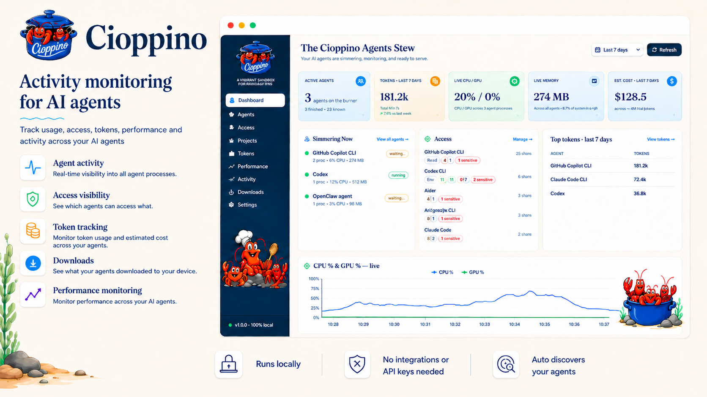

<p align="center">
  
</p>

<h1 align="center">Cioppino</h1>

<p align="center"><strong>The activity monitor for AI agents.</strong></p>

<p align="center">
  <a href="LICENSE"></a>
  <a href="https://github.com/neta2504/cioppino/actions/workflows/ci.yml"></a>
  
  
</p>

Cioppino is a local acitivty monitor that discovers AI agents on your
computer and brings their activity, access indicators, token usage, projects,
downloads, and live process resource use into one view.

It is designed to run on your machine: the server binds to `127.0.0.1`, uses a
random authentication token for each launch, and stores its database locally.

Cioppino runs locally, automatically discovers supported AI agents, requires no
API keys or integrations, and keeps its data on your machine.

<p align="center">
  
</p>

## What Cioppino monitors

- **Agents:** Discovers supported CLI and desktop AI tools, identifies which agents are running, and shows what each is currently working on
- **Access:** Shows what each agent can access, including project folders, MCP servers, extensions, and credential-related configuration, without copying or exposing credential values
- **Activity:** Captures supported local agent activity, including prompt and response history, so you can search, review, and understand what your agents have been doing.
- **Tokens and cost:** reports supported token counters and offers optional,
  cost estimates from an editable local price table.
- **Performance:** Monitors CPU, memory, process activity, latency, and available GPU information to help identify slowdowns, stalls, loops, and resource-heavy agents.
- **Projects and downloads:** Connects agent activity to projects and surfaces package, dependency, and download activity.

## Supported agents

Cioppino currently has 33 agent definitions:

| Form | Agents |
| --- | --- |
| CLI | Claude Code, GitHub Copilot CLI, Codex CLI, Aider, OpenCode, Gemini CLI, Antigravity CLI, OpenClaw, Clawpilot, Claw / Nanobot, Kiro CLI, Junie CLI, goose CLI, Pi Coding Agent |
| Desktop | Cursor, Windsurf, ChatGPT Desktop, Claude Desktop, Codex Desktop, Ollama Desktop, Poe Desktop, Antigravity IDE, Kiro IDE, Zed, goose Desktop, Warp, including Warp Agent |
| IDE Extension | Continue, Cline, Cody, Gemini Code Assist, GitHub Copilot, Codex (IDE), Roo Code |

Capabilities can differ between agents.

## Requirements

- Windows or macOS
- Node.js 24 or newer
- npm 11 or newer

## Install from a release bundle

### Windows

1. Download `Cioppino-vX.Y.Z-windows.zip` and `SHA256SUMS.txt`.
2. Verify the archive checksum.
3. Extract the ZIP.
4. Open the `Cioppino` folder and run `install-and-run.cmd`.

### macOS

1. Download `Cioppino-vX.Y.Z-macos.tar.gz` and `SHA256SUMS.txt`.
2. Verify the archive checksum with `shasum -a 256`.
3. Extract the archive.
4. Run `install-and-run.command`.

Release bundles are not code-signed, and macOS releases are not notarized. As a result, Windows or macOS may display a security warning when you first run the application.

The first launch runs `npm ci --omit=dev` from the included lockfile, which
contacts the npm registry to install runtime dependencies. Normal application
operation does not load UI assets from third-party services. Opening a link from
Cioppino, such as a provider revocation page, leaves the local application.

## Install from source

```powershell
git clone https://github.com/neta2504/cioppino.git
cd cioppino
npm ci
npm run build
npm start
```

Cioppino opens a browser at `http://127.0.0.1:5174`. Set `CIOPPINO_PORT` before
launch if that port is unavailable.

## Development

```powershell
npm ci
npm run dev:backend
```

In a second terminal:

```powershell
npm run dev:frontend
```

The Vite development server runs at `http://127.0.0.1:5173` and proxies API
requests to the backend.

Useful commands:

```powershell
npm run build
npm run test:backend
npm run test:browser
npm test
npm run package
npm run verify:package
```

Playwright downloads Chromium by default. To use an installed Microsoft Edge
browser on Windows:

```powershell
$env:CIOPPINO_TEST_BROWSER = "msedge"
npm run test:browser
```

## Local data and privacy

Cioppino stores derived monitoring data in:

- Windows: `%APPDATA%\Cioppino\cioppino.db`
- macOS: `~/Library/Application Support/Cioppino/cioppino.db`

Imported activity can contain prompts, responses, project paths, command text,
model names, and other sensitive material from supported agent records. Use
**Settings > Wipe all data** to clear Cioppino's database. Removing Cioppino's
database does not delete the original agent records.

Read [PRIVACY.md](PRIVACY.md) for the complete data-handling model.

## Security model

- The backend listens on IPv4 loopback only.
- A random per-launch token protects API access.
- Requests with non-loopback Host headers are rejected.
- Agent configuration readers are bounded and intended to be read-only.
- Credential values, MCP arguments, headers, and URLs are excluded.
- Process termination is user initiated. Supported integration processes are
  re-identified by PID creation time and agent identity before termination.

Cioppino is a local activity monitoring tool, not a security boundary. Review [SECURITY.md](SECURITY.md) before reporting a vulnerability.

## Contributing

Contributions are welcome. Start with [CONTRIBUTING.md](CONTRIBUTING.md), follow
the [Code of Conduct](CODE_OF_CONDUCT.md), and avoid including real credentials,
private transcripts, or personal filesystem paths in issues and tests.

## Project status

Cioppino is early-stage software. Windows and macOS are the supported release
targets, but every release should be smoke-tested on real hardware before
publication. Agent formats change frequently, so integrations may require updates.

See [CHANGELOG.md](CHANGELOG.md) and [SUPPORT.md](SUPPORT.md).

## License

Cioppino is available under the [MIT License](LICENSE).
